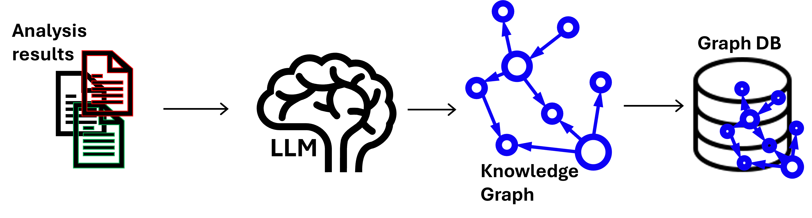
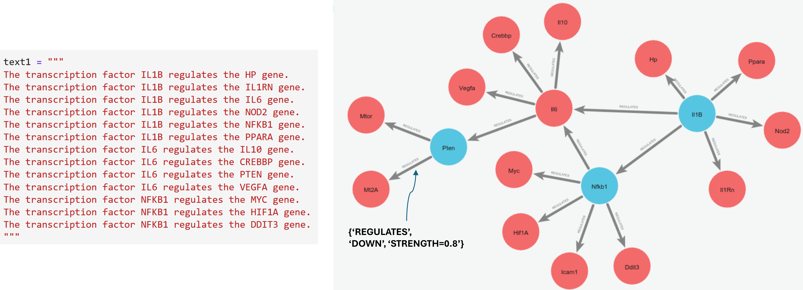
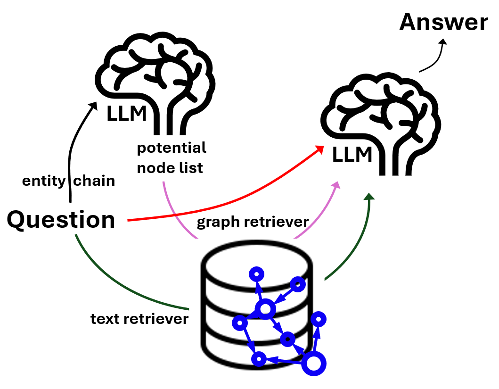

# graphRAG using knowledge graph (neo4j), langchain, Phi4 (LLM)
Construction of the graphRAG agent requires three main service components: 
* a generative large language model (e.g., Phi4:14b),
* a sentence embedding model (e.g., mxbai-embed-large), and
* a graph database server (e.g., Neo4j).

Language models are accessible via API keys (potentially a paid service), Hugging Face pipelines,
or an Ollama server. The Neo4j requirement can be met either by using its cloud database services or by setting
up a local server using a container. A demonstration code for building a simple, small graph is available at
https://github.com/wdnlotm/graphRAG_neo4j_langchain_phi4

## knowledge graph database construction. 

The knowledge graph database is required to contain associated
textual data. Therefore, the input for knowledge graph construction is a corpus of texts. This corpus is processed
by the LLMGraphTransformer from LangChain, leveraging a large language model of choice. The resulting graph
elements—nodes and edges—are then stored in a Neo4j graph database. Properties for both nodes and edges
can be added to the database post hoc. This capability for post hoc database refinement is a powerful addition
to the graphRAG framework, as it allows for the precise entry of numeric values and handling of repeated terms,
areas where Large Language Models typically demonstrate weakness. The workflow schematic, along with an
example of the graph input and output, is displayed in Fig. 1.

**Fig. 1. Schematic diagram of knowledge graph building.** Top: A schematic illustrating the workflow for
building and storing the knowledge graph in a database. Lower Left: An example of the text input used for graph
creation. Lower Right: The resulting knowledge graph, with one of the edge properties displayed.

## GraphRAG LLM agent
The GraphRAG agent comprises three main components (See. Fig. 2): 
1. the entity chain,
2. the graph retriever, and
3. the text retriever.

The entity chain is an LLM query engineered via
prompt-output. For the example shown in Figure 1, its task is to identify and return any genes and transcrip-
tion factors mentioned in the input question as a Python list. Crucially, the LLM does not use a pre-existing
list of genes or transcription factors; instead, it identifies any terms that are potentially gene or transcription
factor names based on context and linguistic patterns. The graph retriever then utilizes this list to find all
edges where a listed item serves as either the source or destination node. This retrieval process is accom-
plished through a series of database query language executions, which can be customized for input-output
processing via natural language processing and structured output formatting. Finally, the text retriever is re-
sponsible for searching and retrieving the text nodes (the textual data stored in the database). To find texts
relevant to the given question, the retriever employs both exact keyword matching and similarity search tech-
niques. Then, the question, the output of graph retriever, and the output of text retriever would be provided to
the LLM as the context and the question. The LLM will compose its answer from these input. A demo code is in
/project/iprime_storage/graphRAG_by_phi4_neo4j.

**Fig. 2. Schematic diagram of graphRAG agent components and workflow.** The retrieved informa-
tion—including the graph edges/nodes (from the graph retriever), the textual data (from the text retriever), and
the original Question—is then passed to the LLM. This LLM synthesizes all the data to produce the final Answer.

## Example of graphRAG internal workflow and output. 
When the question ‘What does IL6 do? Give me the answer in five sentences.’ is entered, the entity chain would return [‘Il6’]. Using this list as input, the graph
retriever is designed to retrieve the resulting graph edges as follows.

>I16 - down-REGULATES -> I110 with a strength of 0.786. 
>I16 - down-REGULATES -> Crebbp with a strength of 0.965. 
>I16 - down-REGULATES -> Pten with a strength of 0.990. 
>I16 - down-REGULATES -> Vegfa with a strength of 0.764. 
>Il1B - up-REGULATES -> I16 with a strength of 0.771. 
>Nfkbl - up-REGULATES -> I16 with a strength of 0.925.

The LLM then receives these retrieved graph edges (including their properties), the related texts, and the original
question to formulate its final answer:

>>IL6 is a transcription factor that down regulates several genes, indicating it suppresses their expression. Specifically, IL6 down regulates the gene Il10 with a strength
of approximately 0.786, suggesting a moderate level of suppression. It also strongly down regulates Crebbp and Pten, with strengths of about 0.966 and 0.991 respectively, indicating
significant suppression. Additionally, IL6 down regulates Vegfa with a strength of around 0.765. These interactions suggest that IL6 plays a crucial role in modulating the expression of genes involved in various cellular processes.

It's worth noting two key observations from this simple test: First, the Phi4:14b model successfully demonstrated its capability of processing numeric values and assigning them semantic meaning. Second, the LLM used only the relevant retrieved edges (the first four out of six total edges) to formulate its answer.
